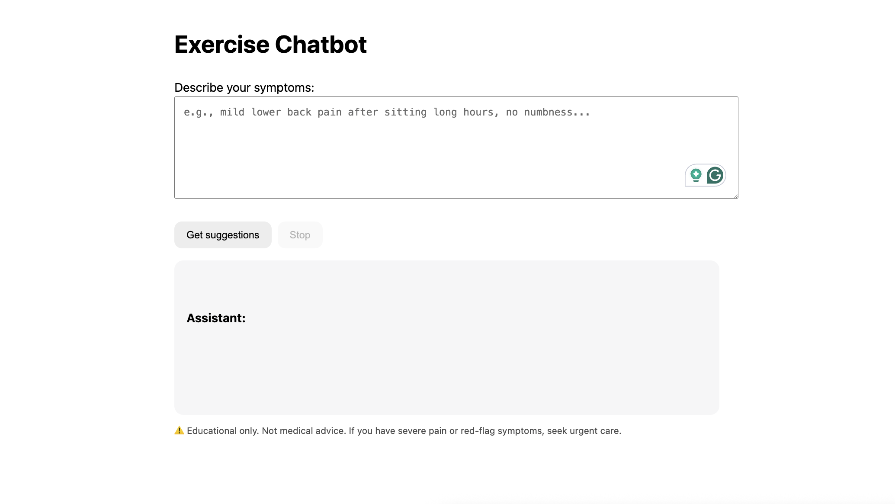
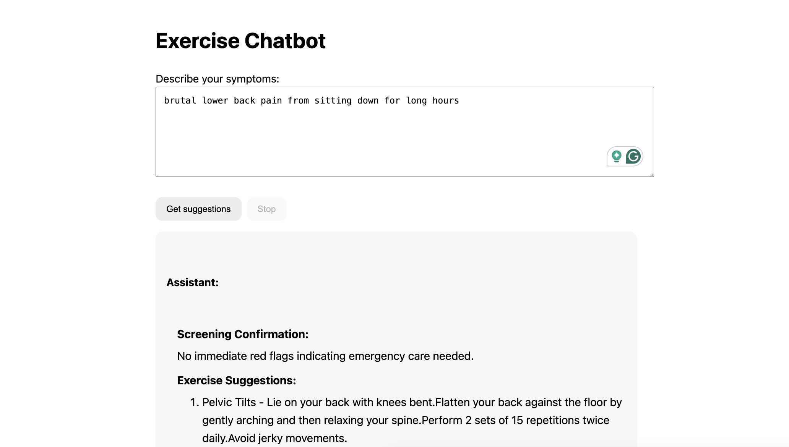
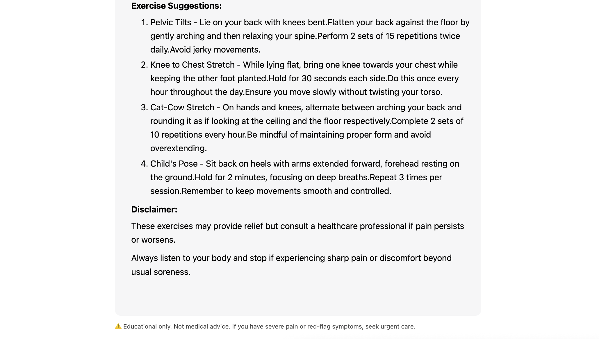

# AI Chatbot for Exercise Recommendations

A tiny Flask app that streams short, safety-first exercise suggestions for common aches and pains.
Runs fully local with Hugging Face transformers (default model: microsoft/Phi-3-mini-4k-instruct).
The frontend formats the live stream into clean headings, paragraphs, and numbered steps as it prints

## Goal

To build a chatbot using Gemini or an open-source LLM that suggests safe and recommended exercises based on the symptoms described by the user.

## Features

- End-to-end streaming via Server-Sent Events (SSE) on /events
- Red-flags first safety logic (urgent care message when detected)
- Grounded suggestions pulled from data/exercises.json
- Live formatter in the browser (cleans glued sentences, builds lists/headings)
- Apple Silicon friendly (MPS) with CPU fallback

## Installation

1. Create & activate a virtual env
```
python3 -m venv venv
source venv/bin/activate
```

2. Install deps
```
pip install --upgrade pip
pip install flask transformers torch
```

3. Project layout
```
mkdir -p data
```

4. Put your exercise library at:
```
#    ./data/exercises.json   (see "Data schema" below)
```

5. Run the app
```
python app.py
```

6. Open the UI
```
http://127.0.0.1:8000
```

## How it works

1. Backend (app.py)
    - GET / renders index.html
    - GET /events?q=... streams text chunks (text/event-stream)
    - A small classifier routes the request:
        - Red flags → streams a fixed caution message (still via the same streamer)
        - Non-symptom → streams a fixed “about the bot” message
        - Otherwise → builds a chat prompt with your system message + grounded moves from exercises.json and streams the model’s output

2. Frontend (index.html)
    - Opens an EventSource('/events?q=...')
    - Accumulates chunks and re-renders formatted HTML every update:
        - Fixes glued sentences (hours.Avoid → hours. Avoid)
        - Puts headings on their own line
        - Collapses multiline bullets into a single 1. list item
        - Renders section titles (Screening Confirmation:, Exercise Suggestions:, Disclaimer:) as <h4>

## Data Schema (data/exercises.json)
Each key is a condition. All fields are arrays of strings.

```
    {
    "<condition_key>": {
        "screening": ["...","..."],
        "tips": ["...","..."],
        "avoid": ["...","..."],
        "see_doctor_if": ["...","..."]   // optional
    }
    }
```

Example (snippet):

```
    {
    "lower_back_pain_mild": {
        "screening": ["no recent trauma", "no numbness/tingling", "no fever", "pain < 6/10"],
        "tips": [
        "5–10 min gentle walking",
        "Pelvic tilts (2x10)",
        "Knee-to-chest stretch (2x20s/side)",
        "Cat-cow (1–2 min)"
        ],
        "avoid": ["heavy lifting", "deep forward bends early"],
        "see_doctor_if": ["pain > 7/10", "leg weakness", "bladder/bowel issues", "pain > 2 weeks"]
    }
    }
```

## Routing new categories
1. Add a block in exercises.json (as above).
2. Map typical keywords to that key in classify():
    ```
    if "shoulder" in s and "pinch" in s:
        return "shoulder_impingement_mild"
    ```

## Folder Layout
```
.
├── app.py
├── index.html
├── data/
│   └── exercises.json
├── README.md
└── venv/ (optional)
```

## Screenshots

### Before the prompt is put in


### After the prompt is put in

